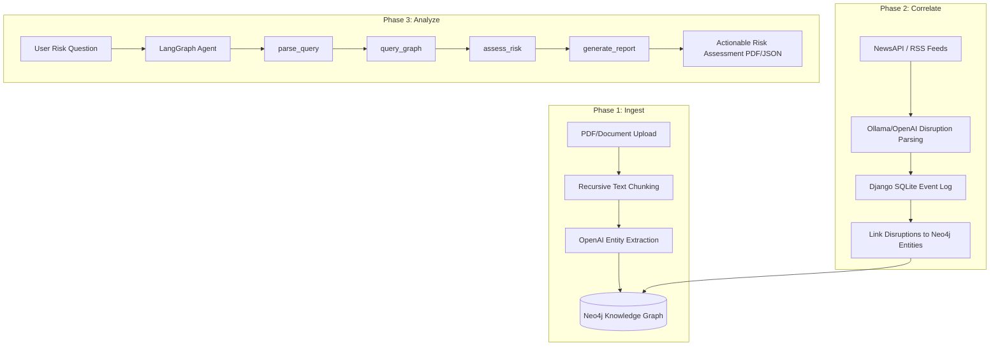

# 🔍 FinTrace — Agentic GraphRAG Supply Chain Monitor

[](https://www.python.org/)
[](https://www.djangoproject.com/)
[](https://neo4j.com/)
[](https://github.com/langchain-ai/langgraph)
[](#)

FinTrace is an enterprise-grade **Agentic Graph Retrieval-Augmented Generation (GraphRAG)** supply chain monitoring platform. It automatically processes unstructured supply chain documentation, extracts semantic entity-relationship knowledge into a graph database, tracks real-time disruptions via news parser intelligence, and leverages a multi-node LangGraph agent to assess dynamic risks.

---

## 🏗️ Core Workflow

FinTrace operates in three distinct phases: **Ingest**, **Correlate**, and **Analyze**.



---

## 🛠️ Technology Stack

| Layer | Technology | Purpose |
| :--- | :--- | :--- |
| **Backend Framework** | Django 5.1 / 6.0 | System orchestration, REST API, admin panel, and session management. |
| **Knowledge Graph** | Neo4j (AuraDB or local) | Storing entities (companies, facilities, ports) and relationships (`SUPPLIES_TO`, `AFFECTED_BY`). |
| **LLM & Agentic Engine** | LangChain / LangGraph | Orchestrates the multi-node reasoning chain and native tool-calling schemas. |
| **AI Models** | OpenAI `gpt-4o-mini` | High-speed, cost-effective entity extraction, structured JSON parsing, and report generation. |
| **Data Validation** | Pydantic v2 | Strict serialization and schema enforcement on graph data and event schemas. |
| **Caching & Queueing** | Redis + Celery | Fast cache lookups for embeddings and async background task scheduling. |
| **Document Processing** | PyPDF / PyMuPDF | Text loading and formatting from complex PDF structures. |

---

## ✨ Features

* **🚀 Automated Graph Construction**: Automatically extract semantic knowledge graphs from raw PDFs and ingest them using Cypher `MERGE` operations.
* **📰 Real-Time News Monitoring**: Periodically pull news, classify supply-chain disruptions (labor strikes, port closures, trade restrictions), and link them to graph entities using the RSS/NewsAPI watcher.
* **🤖 Multi-Node Agentic Risk Assessment**: A robust 4-node LangGraph state-machine (`parse_query` → `query_graph` → `assess_risk` → `generate_report`) evaluating transitively connected supplier risk.
* **⚡ Hybrid JSON Recovery**: Highly-resilient LLM invocation that utilizes native OpenAI structured output with an automatic regex-based fallback parser.
* **🏥 Comprehensive Health Check**: Integrated CLI and HTTP health-checking endpoints monitoring Neo4j database pools, OpenAI API limits, and Redis cache timeouts.
* **🔒 Decoupled Configuration**: Strict separation of credentials and application parameters managed via `python-decouple` and `.env`.

---

## 📂 Project Architecture

```
graph_rag_ai/
├── core/                              # Primary Django application
│   ├── agent/                         # LangGraph Reasoning Engine
│   │   ├── graph.py                   # StateGraph setup & compilation
│   │   ├── nodes.py                   # Node functions (query parser, risk assessor)
│   │   └── state.py                   # State variables & schema definition
│   ├── services/                      # Decoupled business logic services
│   │   ├── neo4j_connection.py        # Thread-safe Neo4j connection pool manager
│   │   ├── graph_builder.py           # Entity extraction & Cypher ingestion
│   │   ├── graph_query.py             # Downstream impact path queries & traversals
│   │   ├── llm.py                     # Centralized ChatOpenAI factory
│   │   ├── news_parser.py             # NewsAPI scrapers & disruption parsers
│   │   └── redis_client.py            # Redis client for cache storage & Celery broker
│   ├── tasks/                         # Async Background workers (Celery)
│   │   ├── ingestion.py               # Multithreaded PDF parsing worker
│   │   └── news_watcher.py            # Periodical RSS scanning worker
│   ├── schemas/                       # Strict Pydantic validators
│   ├── models.py                      # Django ORM models (Document, NewsEvent)
│   └── views.py                       # REST APIs and Dashboard controller
```

---

## ⚙️ Installation & Setup

Follow these steps to deploy a local instance of the FinTrace development stack.

### 1. Clone & Navigate to Project
```bash
git clone <repository_url>
cd graphRAG
```

### 2. Configure Environment Variables
1. Move to the Django project root:
   ```bash
   cd graph_rag_ai
   ```
2. Copy the configuration template:
   ```bash
   cp .env.example .env
   ```
3. Edit the `.env` file with your credentials (must set `NEO4J_*` and `OPENAI_API_KEY`):
   ```env
   DJANGO_SECRET_KEY=generate-a-secure-random-string
   DEBUG=True

   # Database (Neo4j AuraDB or local)
   NEO4J_URI=neo4j+s://6fcfab01.databases.neo4j.io
   NEO4J_USER=neo4j
   NEO4J_PASSWORD=your-neo4j-password

   # LLM Backend
   OPENAI_API_KEY=sk-proj-your-openai-api-key

   # News Watcher
   NEWSAPI_KEY=your-newsapi-key
   ```

### 3. Install Dependencies
Create a virtual environment and load the python package requirements.

#### Option A: Using `uv` (Fast Package Manager)
```bash
uv venv
.venv\Scripts\activate      # Windows
source .venv/bin/activate   # macOS/Linux
uv pip install -r requirements.txt
```

#### Option B: Using Standard Python `pip`
```bash
python -m venv venv
venv\Scripts\activate       # Windows
source venv/bin/activate    # macOS/Linux
pip install -r requirements.txt
```

### 4. Initialize Database & Cache
Initialize Django's SQLite metadata database and create your administrative account:
```bash
# Apply migrations
python manage.py migrate

# Create admin credentials for /admin dashboard
python manage.py createsuperuser

# Compile UI static assets
python manage.py collectstatic --noinput
```

### 5. Verify the Infrastructure
Validate that all external services (Neo4j connection pool, OpenAI API, and Redis backend) are accessible:
```bash
# On Windows PowerShell, enable UTF-8 support first:
$env:PYTHONIOENCODING="utf-8"

python manage.py health_check
```
*You should see a verification status: `✅ All services healthy!`*

---

## 🏃 Running the Application

### Start Development Server
```bash
python manage.py runserver
```
Navigate to **[http://localhost:8000/](http://localhost:8000/)** to open the dashboard.

### Start the News Watcher Scheduler
To periodically scan news feeds and link disruptions to graph entities, run:
```bash
# Run one scan immediately
python manage.py run_news_watcher --once

# Run periodic scan every 60 minutes
python manage.py run_news_watcher --interval 60
```

---

## 📡 API Reference

### Health check
```bash
GET /health/
```

### Ingestion (Upload PDF)
```bash
POST /api/upload/
Content-Type: multipart/form-data
Body: files=@document.pdf
```

### Pathfinding between suppliers
```bash
GET /api/graph/path/?from=SupplierA&to=FactoryB&max_depth=5
```

### Graph Impact Analysis
```bash
GET /api/graph/impacted/?name=PortOfSingapore&max_depth=3
```

### Agentic Risk Assessment Query
```bash
POST /api/query/
Content-Type: application/json
Body:
{
  "question": "What happens to NordOil if the Port of Singapore closes?"
}
```

---

## 🛠️ Troubleshooting

* **DNS Resolution Error (`neo4j.exceptions.ServiceUnavailable`)**: Ensure that the database instance has not been paused on AuraDB, and verify that the URI is exact.
* **Missing API Key (`ValueError`)**: Ensure the `.env` file is in the `graph_rag_ai/` subdirectory and contains a valid, non-expired key.
* **Windows PowerShell UTF-8 Output Crash**: By default, Windows consoles do not print unicode characters used by management commands. Prepend command execution with:
  ```powershell
  $env:PYTHONIOENCODING="utf-8"
  ```
